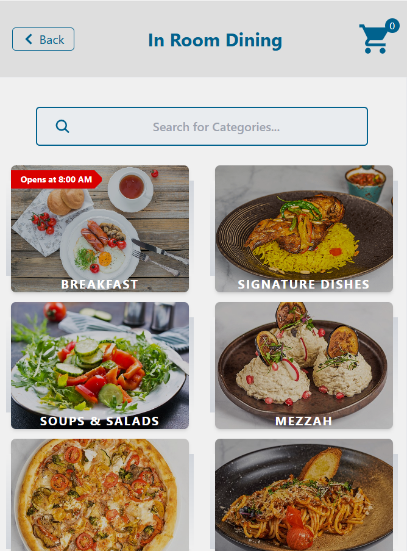
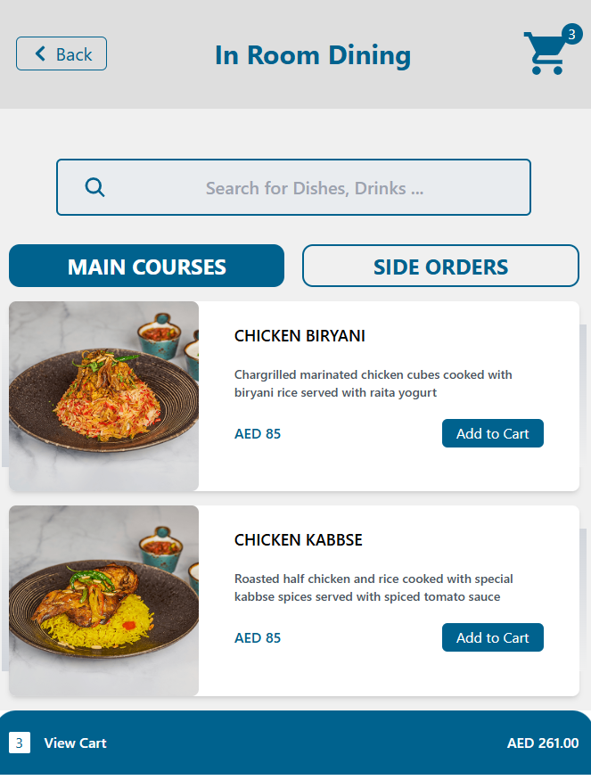
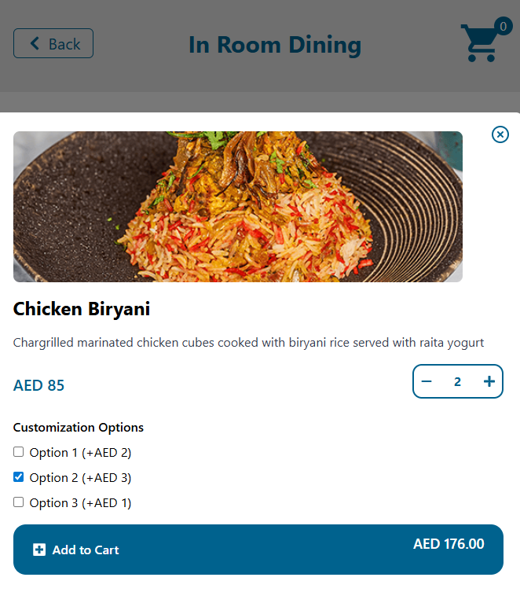

# 🍽️ Restaurant Menu

A modern digital restaurant menu built using **React.js** and **TailwindCSS**.  
The application allows users to browse food categories, explore meals, view item details, and manage a shopping cart through a clean and responsive interface.

This project demonstrates modern frontend development practices including component-based architecture, state management, and scalable UI structure.

---

## 🚀 Live Project Overview

The Restaurant Menu application is a Single Page Application (SPA) designed to simulate a real restaurant ordering experience.

Users can:

- Browse menu categories
- View available dishes
- Open detailed meal information
- Add items to cart
- Manage quantities dynamically
- Navigate smoothly without page reloads

---

## Features

- Responsive design (mobile & desktop)
- Category-based navigation
- Meal details view
- Shopping cart system
- Fast client-side rendering
- Modern UI with TailwindCSS
- Ready for backend/API integration

---

## Application Preview

### Home Page
Displays available meals and menu layout.



---

### Item Details
Detailed information about selected menu items.



---

### 🛒 Add To Cart
Users can add meals and manage cart items.



---

## Tech Stack

### Frontend
- React.js
- React Router DOM
- TailwindCSS
- JavaScript (ES6+)

### State & Data
- React Hooks
- Axios (API ready structure)

### Tooling
- Create React App
- PostCSS
- npm

---

## Installation

Clone the repository:

```bash
git clone https://github.com/AliTechM/restaurant-menu.git

cd restaurant-menu
npm install
npm start
npm start
```
## Open in browser:
http://localhost:3000

## Project Structure
src/
│
├── components/      Reusable UI components
├── pages/           Application pages
├── assets/          Images & static files
├── axios.js         API configuration
└── App.js

 ## Current Version
 v1.0.0

## Contributing

Contributions are welcome.

1-Fork the repository
2-Create a new branch
3-Commit your changes
4-Open a Pull Request

## License
MIT License

## Author
AliTechM
https://github.com/AliTechM

## ⭐Support

If you like this project, consider giving it a ⭐ on GitHub.